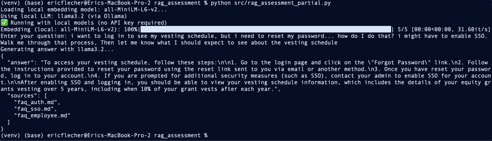
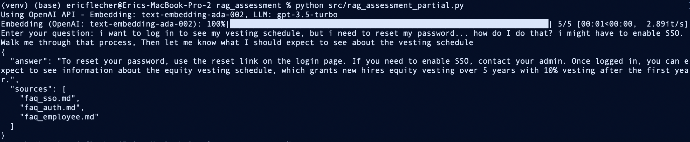

# RAG FAQ Question Answering System

A minimal Retrieval-Augmented Generation (RAG) prototype that answers questions using a small corpus of FAQ documents. Built as a technical demonstration for semantic search and LLM-powered question answering.

**🌟 Runs locally without any API keys!** Uses Ollama + sentence-transformers for completely offline operation. Optional OpenAI integration for cloud-based processing.

## Features

- **🎯 Dual-Mode Operation**: Run with local models (no API key) or OpenAI API
- **🚀 Local-First Default**: Works offline with local models out of the box
- **🔍 Semantic Search**: Finds relevant information using vector embeddings
- **💬 LLM-Powered Answers**: Generates natural language answers with citations
- **📚 Source Citations**: Automatically cites at least 2 source files in responses
- **⚡ Simple CLI**: Interactive command-line interface for queries
- **🎛️ Configurable**: Easy toggle between local and cloud models via .env

## Local FAQ RAG



## OpenAI FAQ RAG



## Architecture

1. **Load & Chunk**: Reads markdown FAQ files and splits into ~200 character chunks
2. **Embed**: Converts text chunks to vector embeddings (local: all-MiniLM-L6-v2 or OpenAI: text-embedding-ada-002)
3. **Query**: Accepts user questions and embeds them using same model
4. **Retrieve**: Finds top-4 most relevant chunks using cosine similarity
5. **Generate**: Creates answers with citations (local: Llama 3.2 or OpenAI: GPT-3.5-turbo)
6. **Output**: Returns JSON with answer and source citations

**Default Mode:** Local models (Ollama + sentence-transformers) - no API key required!

## Requirements

### Option 1: Local Models (Default - No API Key Required)

- Python 3.10+
- Ollama installed
- Dependencies: `sentence-transformers`, `ollama`, `numpy`, `tqdm`, `python-dotenv`

### Option 2: OpenAI API (Cloud-Based)

- Python 3.10+
- OpenAI API key
- Dependencies: `openai`, `numpy`, `tqdm`, `python-dotenv`

## Setup

### 1. Clone and Navigate

```bash
cd rag_assessment
```

### 2. Create Virtual Environment

```bash
python3 -m venv venv
source venv/bin/activate  # On Windows: venv\Scripts\activate
```

### 3. Install Dependencies

**For Local Models (Default):**

```bash
# Install Python dependencies
pip install sentence-transformers ollama numpy tqdm python-dotenv

# Install Ollama
# macOS:
brew install ollama

# Linux:
curl -fsSL https://ollama.com/install.sh | sh

# Windows: Download from https://ollama.com/download

# Pull the LLM model
ollama pull llama3.2
```

**For OpenAI API (Alternative):**

```bash
pip install openai numpy tqdm python-dotenv
```

### 4. Configure Environment

```bash
# Copy template
cp .env.template .env

# For local models (default):
# USE_LOCAL_MODELS=true (already set in template)
# No API key needed!

# For OpenAI API:
# Edit .env and set:
# USE_LOCAL_MODELS=false
# OPENAI_API_KEY=sk-...
```

### 5. Verify FAQ Documents

Ensure `faqs/` directory contains your FAQ markdown files:

```
faqs/
├── faq_auth.md
├── faq_employee.md
└── faq_sso.md
```

## Usage

### Quick Start

Run the application (uses local models by default):

```bash
python src/rag_assessment_partial.py
```

You'll see startup messages and then be prompted:

```
Loading local embedding model: all-MiniLM-L6-v2...
Using local LLM: llama3.2 (via Ollama)
✅ Running with local models (no API key required)
Embedding (local: all-MiniLM-L6-v2): 100%|████████| 5/5 [00:01<00:00]
Enter your question: How do I reset my password?
Generating answer with llama3.2...
```

### Example Output

```json
{
  "answer": "To reset your password, use the reset link on the login page (faq_auth.md).",
  "sources": [
    "faq_auth.md",
    "faq_sso.md"
  ]
}
```

### Switching Modes

**Use OpenAI API:**

```bash
# Edit .env:
USE_LOCAL_MODELS=false
OPENAI_API_KEY=sk-your-key-here

# Run:
python src/rag_assessment_partial.py
# Output: Using OpenAI API - Embedding: text-embedding-ada-002, LLM: gpt-3.5-turbo
```

**Use Local Models:**

```bash
# Edit .env:
USE_LOCAL_MODELS=true

# Run:
python src/rag_assessment_partial.py
# Output: ✅ Running with local models (no API key required)
```

### Sample Queries

**Authentication:**

```bash
python src/rag_assessment_partial.py
# Enter: How do I reset my password?
```

**Employee Policies:**

```bash
python src/rag_assessment_partial.py
# Enter: What is the PTO policy?
```

**Complex Query (Multiple Sources):**

```bash
python src/rag_assessment_partial.py
# Enter: Tell me about SSO and authentication
```

## Configuration

### Environment Variables (.env)

**Primary Mode Selection:**

```bash
USE_LOCAL_MODELS=true   # Default: use local models (no API key)
# Set to 'false' to use OpenAI API
```

**OpenAI Configuration (only when USE_LOCAL_MODELS=false):**

```bash
OPENAI_API_KEY=sk-...
EMBED_MODEL=text-embedding-ada-002  # Optional override
LLM_MODEL=gpt-3.5-turbo            # Optional override
```

**Local Model Configuration (only when USE_LOCAL_MODELS=true):**

```bash
EMBED_MODEL_LOCAL=all-MiniLM-L6-v2  # Optional override
LLM_MODEL_LOCAL=llama3.2            # Optional override
```

### Code Configuration

Edit `src/rag_assessment_partial.py` for additional settings:

```python
FAQ_DIR = "faqs"     # FAQ directory path
CHUNK_SIZE = 200     # Characters per chunk
TOP_K = 4            # Number of chunks to retrieve
```

### Model Comparison

| Feature            | Local Models     | OpenAI API          |
| ------------------ | ---------------- | ------------------- |
| **API Key**  | ❌ Not required  | ✅ Required         |
| **Cost**     | Free             | Pay per use         |
| **Privacy**  | Data stays local | Data sent to OpenAI |
| **Internet** | Offline capable  | Requires internet   |

**Recommendation:** Use local models for development/privacy, OpenAI for production quality.

## Project Structure

```
rag_assessment/
├── .env                      # Configuration (not in git)
├── .env.template            # Template for .env
├── .gitignore               # Git ignore rules
├── README.md                # This file - complete setup & usage guide
├── CLAUDE.md                # Claude Code guidance
├── faqs/                    # FAQ documents
│   ├── faq_auth.md
│   ├── faq_employee.md
│   └── faq_sso.md
├── src/
│   └── rag_assessment_partial.py  # Main dual-mode implementation
├── docs/                    # Technical exercise docs
└── planning/                # Implementation plans & test results
    ├── mvp_implementation_plan.md
    ├── local_model_implementation_plan.md
    ├── baseline_test_results.md
    └── backlog.md
```

## Documentation

- **[Technical Exercise Requirements](docs/)** - Original assessment guidelines and acceptance criteria
- **[MVP Implementation Plan](planning/mvp_implementation_plan.md)** - Detailed MVP implementation blueprints
- **[Local Model Implementation Plan](planning/local_model_implementation_plan.md)** - Detailed local model implementation blueprints
- **[Requirements Completeness Assessment](planning/requirements-completeness-assessment-2025-10-03.md)** - Requirements v. implementation assessment

- **[Feature Backlog](planning/backlog.md)** - Future enhancements and improvements

## How It Works

### 1. Text Chunking

FAQ documents are split into 200-character chunks to create focused, searchable pieces while maintaining context.

### 2. Embedding Generation

Each chunk is converted to vector embeddings capturing semantic meaning:

- **Local**: 384-dimensional vectors via `all-MiniLM-L6-v2`
- **OpenAI**: 1536-dimensional vectors via `text-embedding-ada-002`

### 3. Similarity Search

User queries are embedded using the same model, then compared to chunk embeddings using cosine similarity:

```python
similarity = np.dot(query_vec, chunk_vec) / (||query_vec|| * ||chunk_vec||)
```

### 4. Context Retrieval

The top 4 most similar chunks are retrieved and formatted with source attribution.

### 5. Answer Generation

Retrieved context is provided to the LLM with instructions to:

- Answer based only on provided context
- Cite at least 2 source files
- Provide accurate, factual responses

**Models:**

- **Local**: Llama 3.2 (3B parameters) via Ollama
- **OpenAI**: GPT-3.5-turbo (175B parameters)

## Design Decisions

### Character-Based Chunking

- **Pro**: Simple, predictable, fast implementation
- **Con**: May split sentences awkwardly
- **Alternative**: Semantic chunking (sentence/paragraph boundaries)

### In-Memory Storage

- **Pro**: Simple for small FAQ sets
- **Con**: Not scalable to large document sets
- **Production**: Use vector database (Pinecone, Weaviate, ChromaDB)

### No Caching

- **Pro**: Keeps code simple for demo
- **Con**: Re-embeds chunks on every run
- **Production**: Cache embeddings to file/database

### Individual API Calls

- **Pro**: Progress tracking with tqdm
- **Con**: Slower than batch calls
- **Production**: Batch API calls (up to 2048 inputs per request)

## Troubleshooting

### Local Models Issues

#### "Cannot connect to Ollama"

```bash
# Start Ollama service
ollama serve
```

#### "Model 'llama3.2' not found"

```bash
# Pull the model
ollama pull llama3.2

# Verify it's available
ollama list
```

#### "Module 'sentence_transformers' not found"

```bash
# Install the package
pip install sentence-transformers
```

#### Slow generation on CPU

- Local LLM generation takes ~10-20 seconds on CPU (this is normal)
- For faster inference: Use a GPU or switch to OpenAI mode
- Alternative: Try smaller/faster model like `phi3:mini`

### OpenAI API Issues

#### API Key Error

```
Error: OPENAI_API_KEY not set
```

**Solution**: Ensure `.env` file exists with valid API key and `USE_LOCAL_MODELS=false`

#### Rate Limit Error

```
OpenAI API error: Rate limit exceeded
```

**Solution**: Wait and retry, or upgrade API plan

### General Issues

#### No FAQ Files Found

```
Error: No .md files found in 'faqs/'
```

**Solution**: Verify FAQ directory and file extensions

#### ImportError for packages

```bash
# For local models:
pip install sentence-transformers ollama numpy tqdm python-dotenv

# For OpenAI:
pip install openai numpy tqdm python-dotenv
```

#### Want to test both modes?

```bash
# Test local (temporarily override .env)
USE_LOCAL_MODELS=true python src/rag_assessment_partial.py

# Test OpenAI (temporarily override .env)
USE_LOCAL_MODELS=false python src/rag_assessment_partial.py
```

## Testing

Test with diverse queries to verify:

1. Single-source questions retrieve correct file
2. Multi-source questions cite at least 2 files
3. Answers are factual and grounded in context
4. JSON output is well-formed

### Test Queries

```bash
# Test 1: Single source (faq_auth.md)
python src/rag_assessment_partial.py
# Enter: How do I reset my password?

# Test 2: Single source (faq_employee.md)
python src/rag_assessment_partial.py
# Enter: What is the PTO policy?

# Test 3: Single source (faq_employee.md)
python src/rag_assessment_partial.py
# Enter: How does equity vesting work?

# Test 4: Multiple sources
python src/rag_assessment_partial.py
# Enter: Tell me about SSO and authentication
```

## Production Considerations

This is a minimal prototype. For production:

**Scalability:**

- Use vector database (Pinecone, Weaviate, Qdrant)
- Implement embedding caching
- Batch API calls

**Quality:**

- Add re-ranking after retrieval
- Use semantic chunking with overlap
- Implement query expansion

**Reliability:**

- Add retry logic for API failures
- Implement fallback responses
- Add input validation and sanitization

**Observability:**

- Log query-answer pairs
- Track latency metrics
- Monitor API costs

See `planning/backlog.md` for detailed feature roadmap.

## License

This is a technical demonstration project.

## Acknowledgments

**Local Models:**

- Ollama for easy local LLM management
- Sentence Transformers for embeddings
- Llama 3.2 by Meta AI

**OpenAI:**

- OpenAI API for cloud-based models
- text-embedding-ada-002 and GPT-3.5-turbo

**Core Libraries:**

- numpy for vector operations
- tqdm for progress visualization
- python-dotenv for configuration
